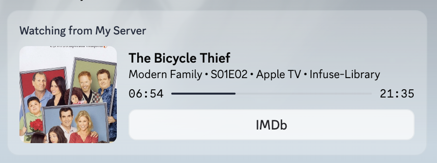

# media-discord-presence



A small cross-platform bridge that shows your current **Emby**, **Jellyfin**, or **Plex** playback as Discord Rich Presence.

It works well with **Infuse**, native Plex clients, web clients, and other players that show up properly in your media server's active sessions.

## Features

- Cleaner package structure, so the entry script stays small
- Shows what you're currently watching on Discord
- Supports **Emby**, **Jellyfin**, and **Plex**
- Strong **Infuse** support
- Also works with **Emby Web**, **Jellyfin Web**, Plex clients, and other supported clients reported by the media server
- Shows device names like `iPhone`, `iPad`, `Apple TV`, browser names, and other client/device labels reported by the server
- Shows elapsed playback time
- Optional Discord image assets and buttons
- Configurable display templates
- Optional auto-generated IMDb and MyAnimeList buttons
- Optional TMDB-backed artwork for movies and shows
- Runs locally on macOS, Linux, and Windows
- No external server required

## How it works

1. The script connects to your configured media servers
2. It polls active playback sessions for your configured user
3. In `provider: "auto"` mode, it picks whichever server currently has an active playback
4. It normalizes the playback metadata into one internal format
5. It updates Discord Rich Presence through the local Discord desktop app

## Requirements

- macOS, Linux, or Windows
- Node.js 18+
- Python 3.10+
- Discord desktop app installed and running
- An Emby, Jellyfin, or Plex server you can access locally or remotely
- A Discord Developer application with an **Application ID**

## Provider support

### Emby
- Fully supported
- Best-tested path so far
- Works especially well with **Infuse**

### Jellyfin
- Supported through the same session-polling model as Emby
- The API shape is very similar to Emby, so support is straightforward
- Still worth treating as less battle-tested unless more people try it

### Plex
- Supported through `/status/sessions`
- Uses `X-Plex-Token`
- Parses Plex XML session data and maps it into the same internal playback model
- More likely to need edge-case feedback because Plex metadata/session shapes vary more by client

## Supported clients

Known good / intended support:
- **Infuse**
- **Emby Web**
- **Jellyfin Web**
- Plex clients that appear in Plex active sessions

It should also work with other clients as long as the selected media server reports them properly as active playback sessions for your user.

## Install

Install from npm:

```bash
npm install -g media-discord-presence
```

Then run:

```bash
media-discord-presence
```

On first run, the CLI will walk through config setup interactively and write the runtime config, then install/start the background service for your OS:
- macOS: `launchd`
- Linux: `systemd --user` when available, otherwise a detached background process
- Windows: Startup script plus detached background process
The setup wizard supports arrow-key selection, masked secret inputs, editing an existing config, and basic provider connection checks before saving.

Useful commands:

```bash
media-discord-presence setup
media-discord-presence edit
media-discord-presence start
media-discord-presence stop
media-discord-presence restart
media-discord-presence status
media-discord-presence foreground
media-discord-presence uninstall
```

## Config

Example:

```json
{
  "provider": "auto",
  "client_filters": [],
  "poll_interval_seconds": 15,
  "tmdb": {
    "api_key": "",
    "bearer_token": ""
  },
  "discord": {
    "client_id": "YOUR_DISCORD_APP_ID",
    "large_image": "optional_uploaded_asset_key",
    "small_image": "optional_uploaded_asset_key",
    "small_text": "Watching via media server",
    "buttons": [],
    "status_display": "auto",
    "omdb_api_key": "",
    "auto_buttons": {
      "imdb": false,
      "mal": false
    },
    "templates": {
      "episode_details": "{title}",
      "episode_state": "{show} • {se} • {device_client}",
      "movie_details": "{title}{year_suffix}",
      "movie_state": "{device_client}",
      "track_details": "{title}",
      "track_state": "{artist} • {album} • {device_client}",
      "default_details": "{title}",
      "default_state": "{device_client}"
    }
  },
  "emby": {
    "url": "http://127.0.0.1:8096",
    "username": "your-emby-username",
    "password": "your-emby-password"
  },
  "jellyfin": {
    "url": "http://127.0.0.1:8096",
    "username": "your-jellyfin-username",
    "password": "your-jellyfin-password"
  },
  "plex": {
    "url": "http://127.0.0.1:32400",
    "token": "PLEX_TOKEN_HERE",
    "username": "your-plex-username"
  }
}
```

### Config fields

#### Top-level
- `provider`: `auto`, `emby`, `jellyfin`, or `plex`
- `client_filters`: optional list of client-name filters. Use `[]` to allow any supported client for that user
- `poll_interval_seconds`: how often to check sessions

#### TMDB
- `tmdb.api_key`: optional TMDB API key for dynamic artwork lookup
- `tmdb.bearer_token`: optional TMDB read access token; use this instead of `api_key` if you prefer
- If both are empty, artwork lookup is disabled

When `provider` is `auto`, the bridge checks configured providers in this order: `plex`, `jellyfin`, then `emby`, and uses whichever one currently has an active session.

#### Discord
- `discord.client_id`: your Discord Developer Application ID
- `discord.large_image`: optional uploaded Discord asset key
- `discord.small_image`: optional uploaded Discord asset key
- `discord.small_text`: optional tooltip for the small image
- `discord.buttons`: optional Discord buttons, up to 2
- `discord.status_display`: optional top status text source: `auto`, `name`, `state`, or `details`
- `discord.omdb_api_key`: optional OMDb API key used for IMDb button lookup
- `discord.auto_buttons`: optional auto-link toggles for `imdb` and `mal`
- `discord.templates`: optional display templates

Template variables:
- `{title}`: media title
- `{show}`: TV show name
- `{season}`: season number
- `{episode}`: episode number
- `{se}`: formatted episode code like `S01E02`
- `{year}`: release year
- `{year_suffix}`: formatted as ` (2024)` when a year exists
- `{genres}`: comma-separated genres when available
- `{artist}`: music artist when available
- `{album}`: album name when available
- `{device}`: device name
- `{client}`: client/app name
- `{device_client}`: deduplicated `device • client`
- `{paused}`: `true` or `false`

#### Emby
- `emby.url`: Emby base URL
- `emby.username`: Emby username
- `emby.password`: Emby password
- `emby.user_id`: optional fixed Emby user id
- `emby.authorization_header`: optional auth header override

#### Jellyfin
- `jellyfin.url`: Jellyfin base URL
- `jellyfin.username`: Jellyfin username
- `jellyfin.password`: Jellyfin password
- `jellyfin.user_id`: optional fixed Jellyfin user id
- `jellyfin.authorization_header`: optional auth header override

#### Plex
- `plex.url`: Plex base URL
- `plex.token`: Plex token
- `plex.username`: Plex username to match active sessions
- `plex.user_id`: optional Plex user id if you prefer matching by id
- `plex.client_identifier`: optional client identifier override
- `plex.product`: optional product name override for Plex headers
- `plex.version`: optional version override for Plex headers
- `plex.device_name`: optional device name override for Plex headers

## Run

### From the repo directory

If you already ran `./install-launch-agent.sh`, the repo-local `.venv` should already exist.

```bash
PYTHONPATH=src ./.venv/bin/python -m media_discord_presence
```

### macOS / Linux

Foreground:

```bash
cd ~/.local/share/media-discord-presence && ./.venv/bin/python -m media_discord_presence
```

Background:

```bash
cd ~/.local/share/media-discord-presence && nohup ./.venv/bin/python -m media_discord_presence > media-discord-presence.log 2>&1 &
```

### Windows (PowerShell)

Foreground:

```powershell
Push-Location "$env:USERPROFILE\media-discord-presence"
& "$env:USERPROFILE\media-discord-presence\.venv\Scripts\python.exe" -m media_discord_presence
Pop-Location
```

Background:

```powershell
Start-Process -WorkingDirectory "$env:USERPROFILE\media-discord-presence" -FilePath "$env:USERPROFILE\media-discord-presence\.venv\Scripts\python.exe" -ArgumentList "-m media_discord_presence"
```

## Example output

Typical Discord card:
- App name: `Watching` or whatever you name your Discord app
- Line 1: `Frieren: Beyond Journey's End`
- Line 2: `iPhone • Infuse • S01E14 • Privilege of the Young`

## Troubleshooting

- See [docs/TROUBLESHOOTING.md](docs/TROUBLESHOOTING.md) for LaunchAgent fixes, config-path mismatches, Plex token issues, and Tailscale/Plex discovery notes.

## Notes

- Discord caches app metadata sometimes. If you rename your Discord app, restart Discord.
- Rich Presence must run under the **same logged-in desktop user/session** as Discord.
- The top app title comes from your Discord Developer application name, not from the script.
- Discord will not fetch poster art directly from Emby/Jellyfin/Plex URLs for RPC. This project can instead use TMDB artwork URLs when `tmdb` is configured, or fall back to uploaded Discord assets.
- IMDb/MAL buttons are optional metadata lookups. Discord only shows Rich Presence buttons to other people, not to you.
- Plex support uses XML session parsing instead of the Emby/Jellyfin JSON flow.
- In `provider: "auto"` mode, keep each provider block filled in if you want that server to be considered during detection.
- Jellyfin and Plex support are newer than the original Emby path, so feedback is especially useful.

## Startup

### macOS

A helper installer is included:

```bash
./install-launch-agent.sh
```

This copies the package into your user directory, installs dependencies, creates a LaunchAgent so it can start automatically when you log in, and also bootstraps a repo-local `.venv` for manual runs from the repo.

Manual LaunchAgent flow, if you do not want to use the installer:

1. Copy `examples/com.media-discord-presence.plist` to `~/Library/LaunchAgents/com.media-discord-presence.plist`
2. Replace `YOUR_USER` with your actual username
3. Load it with:

```bash
launchctl bootstrap gui/$(id -u) ~/Library/LaunchAgents/com.media-discord-presence.plist
launchctl kickstart -k gui/$(id -u)/com.media-discord-presence
```

### Linux (systemd user service example)

Copy `examples/media-discord-presence.service` to `~/.config/systemd/user/media-discord-presence.service`, then enable it:

```bash
systemctl --user daemon-reload
systemctl --user enable --now media-discord-presence.service
```

### Windows (Startup folder)

Use `examples/start-media-discord-presence.bat`, then place a shortcut to that batch file in:

```text
%APPDATA%\Microsoft\Windows\Start Menu\Programs\Startup
```

If you prefer Task Scheduler instead, create a task that runs at logon with:

```text
%USERPROFILE%\media-discord-presence\.venv\Scripts\python.exe
```

and argument:

```text
-m media_discord_presence
```

## Project structure

```text
src/
  media_discord_presence/
    __init__.py
    __main__.py                   # module entry point
    app.py                        # app loop
    config.py                     # config path + loading
    discord_rpc.py                # Discord RPC update logic
    models.py                     # shared playback model
    providers.py                  # media server session fetching
```

## Security

- Do **not** commit your real `config.json`
- Use `config.example.json` as the template
- Use a dedicated Emby/Jellyfin/Plex user if you want tighter separation
- Treat Plex tokens like secrets

## License

MIT
